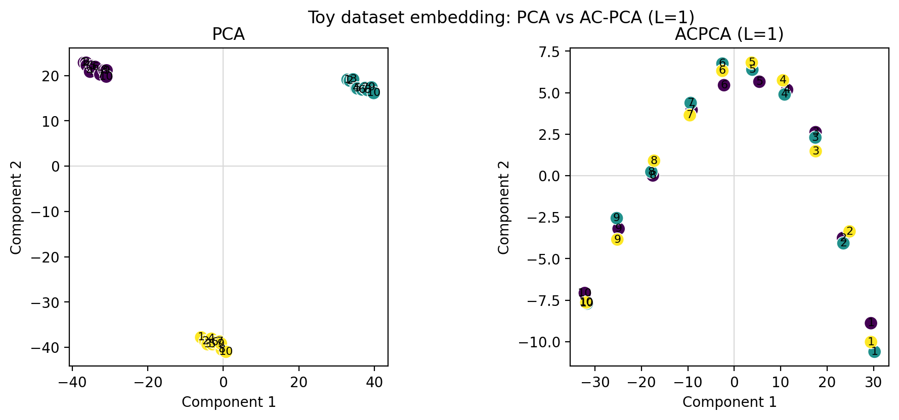

# ACPCA: Adjusted for Confounding Principal Component Analysis

ACPCA is a Python implementation of Adjusted for Confounding Principal Component Analysis, a method designed to mitigate technical variation (batch effects) from high-dimensional data while preserving signal.

## Installation

### Using conda (recommended)

Clone the repository and install the required dependencies:

```bash
git clone https://github.com/vgainullin/acpca.git
cd acpca
conda env create -f environment.yaml
conda activate acpca
```

### Using pip

```bash
pip install -r requirements.txt
```

## Quick Start

```python
from acpca import ACPCA
from acpca.utils import create_synthetic_data

# Generate synthetic data
X, Y, batch_labels = create_synthetic_data(
    n_samples=300,
    n_genes=1000,
    num_batches=3,
    n_groups=2
)

# Initialize and fit ACPCA
acpca = ACPCA(n_components=2, L=0.5)
acpca.fit(X, y=batch_labels)

# Transform data
X_transformed = acpca.transform(X)
```

## Detailed Usage

### Lambda Parameter Selection

The lambda parameter controls the trade-off between batch effect removal and preservation of signal. AC-PCA supports two methods for automatically selecting the optimal lambda:

1. Original Method (from the AC-PCA paper):
```python
acpca = ACPCA(n_components=2, L=-1, lambda_method='original')
acpca.fit(X, y=batch_labels)
```

2. Silhouette Score Method:
```python
acpca = ACPCA(n_components=2, L=-1, lambda_method='silhouette')
acpca.fit(X, y=batch_labels)
```

### Visualization

```python
# Fit AC-PCA with automatic lambda selection
acpca = ACPCA(n_components=2, L=-1)
acpca.fit(X, y=batch_labels)

# Plot lambda optimization results
acpca.plot_lambda_optimization()
```

#### Toy Example (Unit Test)

The toy dataset in `data/data_example1.csv` (used by the AC-PCA unit tests) highlights
how the method removes batch structure while preserving biological signal. Colors
in the plot below correspond to sequencing batches, and marker shapes indicate the
biological replicate annotation. Standard PCA clusters by batch, whereas AC-PCA
with `L=1` collapses batch-driven variation so that replicates align. The implementation
aligns component orientation by default, making it easier to compare to PCA runs.



You can regenerate the figure by running:

```python
import pandas as pd
import matplotlib.pyplot as plt
from acpca import ACPCA
from sklearn.preprocessing import StandardScaler
from sklearn.decomposition import PCA

frame = pd.read_csv('data/data_example1.csv')
X = frame.iloc[:, :-2].to_numpy()
batches = frame['batch_labels'].to_numpy()
annotations = frame['point_annotation'].astype(str).to_numpy()

# Baseline PCA on centered data (matches ACPCA preprocessing)
X_centered = StandardScaler(with_mean=True, with_std=False).fit_transform(X)
pca_coords = PCA(n_components=2).fit_transform(X_centered)

# AC-PCA emphasises biology over batch
acpca = ACPCA(n_components=2, L=1.0, preprocess=True)
acpca_coords = acpca.fit_transform(X, batches)

def _plot(coords, title, ax):
    scatter = ax.scatter(
        coords[:, 0],
        coords[:, 1],
        c=batches,
        cmap=plt.colormaps['viridis'],
        s=90,
        edgecolor='white',
        linewidth=0.6,
    )
    for xval, yval, label in zip(coords[:, 0], coords[:, 1], annotations):
        ax.text(xval, yval, label, fontsize=8, ha='center', va='center', color='black')
    ax.set_title(title)
    ax.set_xlabel('Component 1')
    ax.set_ylabel('Component 2')
    ax.axhline(0.0, color='0.85', linewidth=0.8, zorder=0)
    ax.axvline(0.0, color='0.85', linewidth=0.8, zorder=0)
    ax.set_box_aspect(1.0)
    return scatter

fig = plt.figure(figsize=(11, 4.2))
panel_width = 0.35
panel_height = 0.75
left_margin = 0.08
bottom_margin = 0.14
gap = 0.10
axes = [
    fig.add_axes([left_margin, bottom_margin, panel_width, panel_height]),
    fig.add_axes([left_margin + panel_width + gap, bottom_margin, panel_width, panel_height]),
]

_plot(pca_coords, 'PCA', axes[0])
_plot(acpca_coords, 'ACPCA (L=1)', axes[1])
fig.suptitle('Toy dataset embedding: PCA vs AC-PCA (L=1)')
fig.savefig('assets/acpca_vs_pca_toy.png', dpi=200, bbox_inches='tight')
```

## API Reference

### ACPCA Class

```python
ACPCA(Y=None, n_components=2, L=0.0, lambda_method='original')
```

Parameters:
- `Y`: array-like, optional - Confounding labels
- `n_components`: int - Number of components to keep
- `L`: float - Lambda value. If -1, best lambda will be calculated
- `lambda_method`: str - Method to calculate best lambda: 'original' or 'silhouette'

Methods:
- `fit(X, y=None)`: Fit the AC-PCA model
- `transform(X)`: Apply dimensionality reduction to X
- `plot_lambda_optimization()`: Visualize lambda selection process
- `get_params()`: Get parameters for this estimator
- `set_params(**params)`: Set the parameters of this estimator

### Utility Functions

```python
create_synthetic_data(
    n_samples=300,
    n_genes=1000,
    num_batches=3,
    n_groups=2,
    random_state=42
)
```

Generates synthetic gene expression data with batch effects and biological groups.

Parameters:
- `n_samples`: Number of samples (cells/specimens)
- `n_genes`: Number of genes (features)
- `num_batches`: Number of technical batches
- `n_groups`: Number of biological groups
- `random_state`: Random seed for reproducibility

## Examples

See the `notebooks/experiments.ipynb` notebook for detailed examples and visualizations, including:
- Basic usage with synthetic data
- Comparison of lambda selection methods
- Visualization of batch effect removal
- Real-world data examples

## Performance Tips

1. Scale your data before applying AC-PCA
2. Use the silhouette method for lambda selection with smaller datasets
3. Use the original method for larger datasets where computational efficiency is important
4. Consider reducing dimensionality with standard PCA before applying AC-PCA for very large datasets

## References

If you use this implementation in your research, please cite the original research paper:

```bibtex
@article{acpca2016,
  title={AC-PCA: simultaneous dimension reduction and adjustment for confounding variation bioRxiv},
  author={Z. Lin, C. Yang, Y. Zhu, J. C. Duchi, Y. Fu, Y. Wang, B. Jiang, M. Zamanighomi, X. Xu, M. Li, N. Sestan, H. Zhao, W. H. Wong},
  journal={bioRxiv},
  year={2016},
  doi={http://dx.doi.org/10.1101/040485}
}
```

## License

This project is licensed under the MIT License - see the LICENSE file for details.

## Contributing

Contributions are welcome! Please feel free to submit a Pull Request.

1. Fork the repository
2. Create your feature branch (`git checkout -b feature/AmazingFeature`)
3. Commit your changes (`git commit -m 'Add some AmazingFeature'`)
4. Push to the branch (`git push origin feature/AmazingFeature`)
5. Open a Pull Request

### Development Setup

1. Clone your fork
2. Install development dependencies: `conda env create -f environment.yaml`
3. Install pre-commit hooks: `pre-commit install`
4. Run tests: `pytest tests/`
